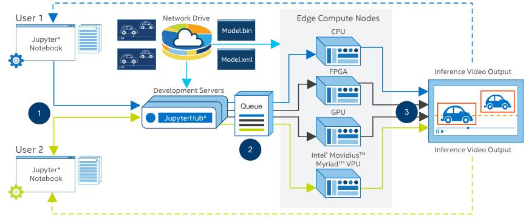

# About the IOT DevCloud Workflow

What you should know before running the examples:

* Each example runs in a Jupyter Notebook environment on a development server based on an Intel® Xeon® Scalable processor.
* To execute inference on edge compute servers, your Jupyter Notebooks submit scripts into a job queue.

Your home directory on the development server is network-shared between the development server and edge compute servers.

Figure 1 illustrates the process flow involved in job submission.

