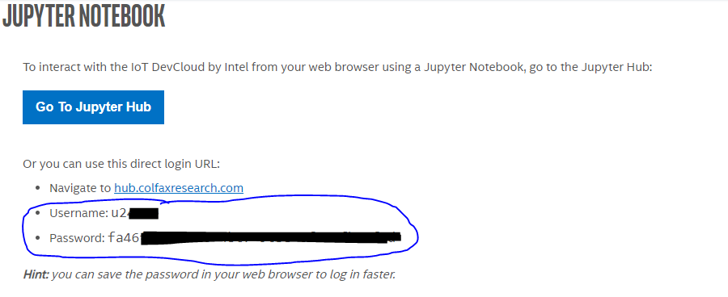
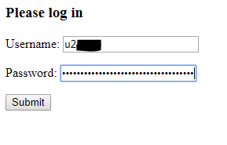
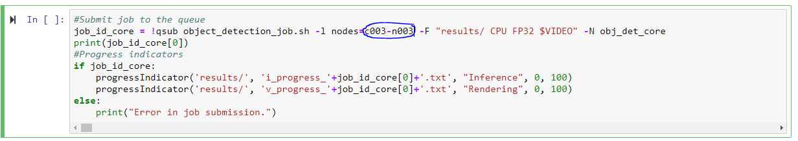
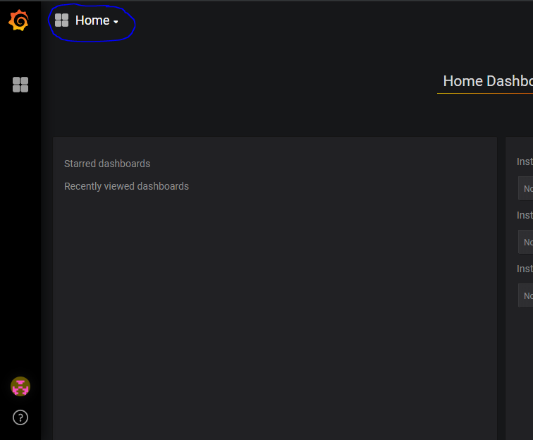
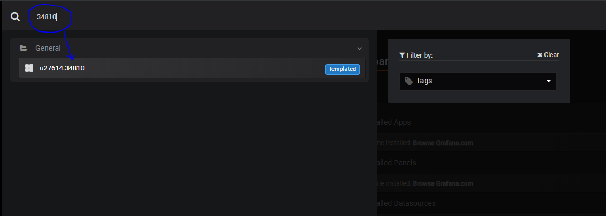

**Steps to use Metering capability in IoT DevCloud by Intel**
=============================================================

**Step 1: Create Metering account**
-----------------------------------

1.  Metering account will be automatically created on the first login. Follow the below steps to login. If you have already created an account previously skip this step.
2.  Go to IoT DevCloud home page and click on Connect. Copy the user name and password from the following page.

3.  Go to Metering login page at https://metering.colfaxconnect.com/
4.  Use the same user name and password to login to Metering. Click on submit.

5.  It might take a while if you are logging in for the first time.

**Step 2: Submit Job to an edge compute node with Metering capability**
-----------------------------------

1.  Login to Jupyter Hub.
2.  Open any Jupyter notebook from `iot-devcloud/meteringSamples`. 
3.  Go to “Job queue submission” cell and specify the node on which you want to run the job.

**Note :**  As of now Metering is enabled only on edge compute nodes with IDs  c003-n003 to c003-n012

4.  Run all the required cells as instructed in the notebook and submit the job.
5.  Please wait for the inference jobs and video rendering to complete before proceeding to the next step.

**Step 3: Login to Metering dashboard**
-----------------------------------

1.  The automation will create a Metering dashboard with the name {User ID}.{Job ID} after the job is completed. Please check the status of the job before you check for the dashboard.
2.  Follow step 1 to login to Metering.
3.  Once you login, click on the “Home” drop down.

4.	From the drop down search and select the dashboard with {Job ID}.

